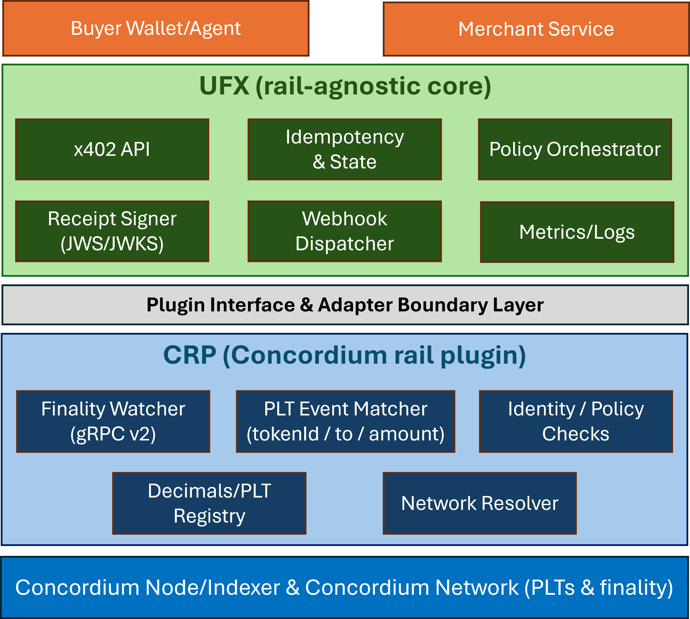

# x402 Concordium-aware Facilitator (XCF)

## 🧱 Architecture (layered)

  

**XCF consists of two layers:**
- **UFX (Universal Facilitator for x402)** – rail-agnostic core that exposes the x402-friendly API, enforces idempotency/expiry, signs verifiable receipts (JWS), and emits webhooks/metrics.
- **CRP (Concordium Rail Plugin)** – rail-specific adapter that talks to a Concordium **gRPC v2** node, reads **finalized** blocks, parses PLT (protocol-level token) transfers, and matches exact payments.

> **PoC scope:** No custody; no on-chain contracts. Finality-only, exact amount matching, signed receipts, and minimal merchant integration (webhook + polling).

---

## ✨ Demo outcome
A payer scans a QR (or taps NFC), sends the exact PLT amount to the `pay_to` address, and the terminal shows a **green check** as soon as XCF issues a signed receipt.

---

## 📐 Hard guarantees
- **Finality-only**: match only transactions in **last-finalized** blocks (no mempool/pending).
- **Exact tuple match**: `{ tokenId, to, amountMinor }`, where `amountMinor = toMinorUnits(amount, decimals)`; **no slippage**.
- **Idempotency**: same `nonce` + identical payload ⇒ same outcome; same `nonce` + different payload ⇒ **422**.
- **Verifiable receipts**: compact JWS with `kid`; JWKS published at `/.well-known/jwks.json`.
- **Auth everywhere**: all facilitator endpoints require auth; CORS allow-list enforced.

---

## 🧭 Milestones (status)
### M1 – UFX API skeleton

- Node/TypeScript + Fastify service
- Basic health endpoints:
  - `GET /healthz`
  - `GET /v1/crp/health`

### M2 – CRP wiring (gRPC v2)

- Concordium testnet gRPC wiring via `src/crp/grpc.ts`
- Consensus & account reads:
  - `GET /v1/crp/consensus`
  - `GET /v1/crp/account/:address`
- Basic CRP payments search stub
- Local smoke tests:
  - `npm run smoke:crp`
  - `npm run smoke:plt` (initial stub)

### M3 – PLT stream ingest & CRP payments search

- Database migration for PLT stream ingest:
  - `db/migrations/002_m3_stream.sql`
- PLT decimals & parsing:
  - `src/crp/decimals-registry.ts`
  - `src/crp/parser.ts`
- Stream worker & stream control:
  - `src/crp/stream.ts`
  - `src/crp/stream-worker.ts`
- Postgres stores:
  - `src/store/plt.pg.ts` – PLT events
  - `src/store/match.pg.ts` – matched payments
- CRP routes:
  - `GET /v1/crp/payments/search`
    - Filters: `merchantId`, `status`, `limit` (and default unfiltered listing)
- Demo tooling:
  - `scripts/migrate-002-m3-stream.js` – apply M3 migration
  - `scripts/debug-*.js` – consensus, PLT events, seeding demo challenges
  - `scripts/smoke-idempotency.sh` – create/idempotent/409 conflict flow for JWS receipts

Status: **M3 is implemented and merged into `main`.**

